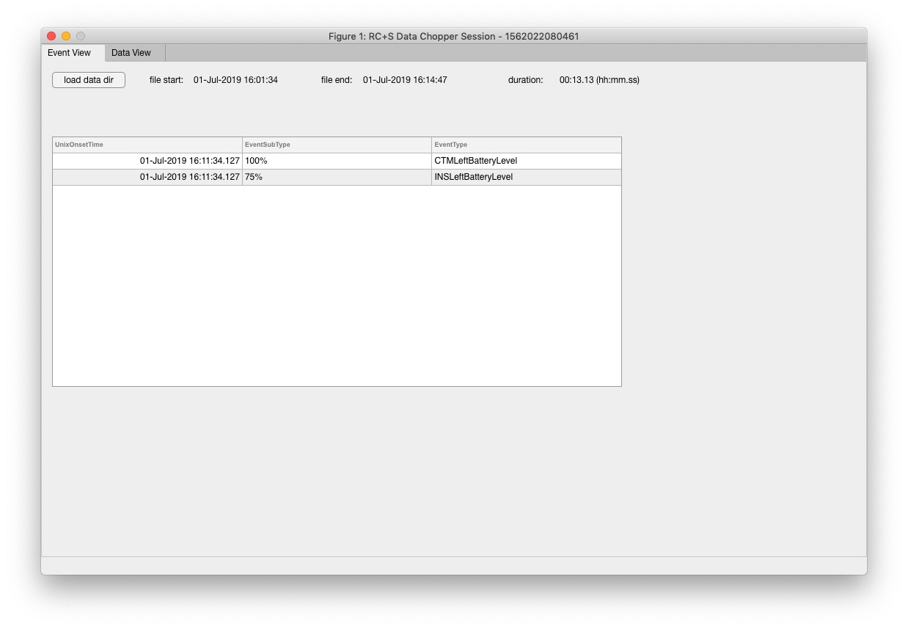

Summit RC+S preprocessing and analysis functions
==

Summary: 
-------------

This collection of code allows the preprocessing analysis and plotting of RC+S data. It includes a collection of GUI tools to plot the data in interactive form as well as command line (Matlab) tools to get at the raw data. It also has some code to allow syncing to Delsys data. 

Tips for data recording 
-------------
Sample data files for recording at home, in clinic and for aDBS are provided. 

* Check the sensing settings:
	* Mode 3/4: Recording in mode 3 allows reliable transmission at 4500 bps at a larger range, whereas mode 4 allows 6000 bps at a shorter range. At home we usually use mode 3 and in clinic mode 4.  
	* Sampling rate: 2 time domain channels @1000Hz, 4 @500hz.   
	* Recording electrodes: Make sure to check recording electrodes are correct. 
	* Make sure all the channels you want are "enabled". 
	* Check both stream and sense enables are set correctly. 
	* Check that current settings will not create packet loss using this excel sheet. 

Installation instructions
-------------

* Download the repository 
* Before every use please run the function `updateandcheckdepedencies`. 

Samples of raw RC+S time domain data (in JSON format) with the processed "tidy" output created from it are available in the `sample_data` folder of this repo.

GUI Tools
-------------

#### RC+S Session Viewer 

This is the "gateway" into easily reading a large directory with session folders from RC+S. Run `rcsSessionViewer` from the command line. Note that you need `Matlab 2018b` or newer to run this function. Click "load dir":

Choose a directory that contains all the session folders: 

And you will get this view: 

Clicking on any row will bring up the `RC+S data chopper` that will allow you to view interactive version of the data. 

#### RC+S Data Chopper 

This will bring up the RC+S data chopper: 

This has two tabs - an event tab and a data view tab. Navigate to the data view tab: 

The data viewer has many functions. It allows you zoom into the data, plot PSD's and spectrograms,zoom into specific events and save data "chunks" for later analysis. Here is a run down - going top left to right: 

* Note that the session name (folder) is in the title of the window. 
* `From\To dropdown` - these buttons will zoom in on events  
* `zoom out` - zooms all the way out 
* `print label struc` - prints the channels out to the command line 
* `lblstruct dropdown` - this will switch the channel labels if more than one recording param was used 
* `save` - saves the current view as a data chunk in the directory in which the data exists 
* `From\To text boxes` - if you input time information it will zoom into these times (press return). 
* `plot psd` - plots psd of zoomed in section 
* `plot spectrogram` - plots spectrogram of zoomed in section 
* `Save name` - saves the current data chunk with the name given in text box 

#### RC+S Delsys analysis tool 

TBD 

What does the raw data look like? 
-------------
The following `.json` files are created with each recording session: 
* `DeviceSettings`
* `DeviceSettings`
* `DeviceSettings`
* `DeviceSettings`
* `DeviceSettings`

What command line tools exist to read and open data? 
-------------
#### Plot raw data 
* `DeviceSettings`- details about getting raw data 

#### Preprocess a large amount of data 
currently preprocessing a large amount of data takes a long time. 
* `DeviceSettings`
* `DeviceSettings`
* `DeviceSettings`

To Do: 
-------------
* Add routines to process data folders 
* Consider implementing more efficient datetime storage (double rather than string) if human readability not important. 
* Backtrace first packet `timestamp` from a system rollover. 
* Consider using data that exists in TimeSync.json option.
